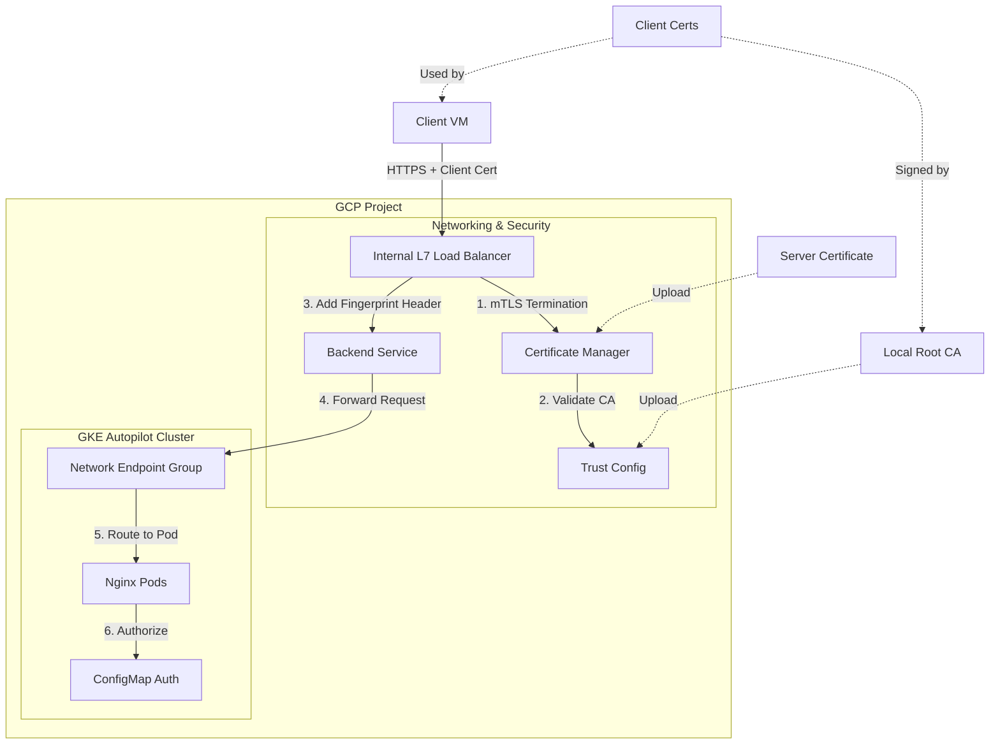

# mTLS on Google Cloud Platform (GCP)

This project demonstrates how to implement Mutual TLS (mTLS) using an Internal Layer 7 Load Balancer (ILB) on GCP, with a GKE Autopilot backend. It includes automated certificate generation, infrastructure provisioning, and a fingerprint-based authorization mechanism at the backend level.

## Architecture



## How it Works

1.  **Mutual TLS (mTLS) Termination**: The Internal L7 Load Balancer terminates the TLS connection. It is configured with a `ServerTlsPolicy` that requires a valid client certificate signed by the Root CA stored in the `TrustConfig`.
2.  **Certificate Fingerprint Propagation**: Upon successful mTLS handshake, the Load Balancer extracts the SHA256 fingerprint of the client certificate and injects it into the `X-Client-Cert-Fingerprint` HTTP header.
3.  **Backend Authorization**: The Nginx backend (running in GKE) receives the request. It uses an Nginx `map` directive (configured via `ConfigMap`) to validate the received fingerprint against a list of authorized clients. If the fingerprint is not recognized, it returns a `403 Forbidden`.

## Project Structure

*   `infra/`: Shell scripts for provisioning GCP resources (VPC, GKE, LB, TrustConfig, etc.).
*   `certs/`: Local directory for generated certificates (CA, Server, Clients).
*   `k8s-setup/`: Kubernetes manifests for the Nginx deployment, service, and configuration.
*   `Fingerprints.md`: Generated list of client certificate fingerprints for easy reference.

## How to Deploy

1.  **Generate Certificates**:
    ```bash
    ./infra/certs.sh
    ```
2.  **Provision Infrastructure**:
    ```bash
    ./infra/provision.sh
    ```
3.  **Deploy to Kubernetes**:
    ```bash
    gcloud container clusters get-credentials mtls-gke-cluster --region=europe-west3
    kubectl apply -f k8s-setup/nginx.yaml
    ```
4.  **Configure Backend**:
    ```bash
    ./infra/configure-backend.sh
    ```

## How to Test

1.  **SSH into the Test Client**:
    ```bash
    gcloud compute ssh mtls-test-client --zone=europe-west3-a --tunnel-through-iap
    ```
2.  **Run the Test Script**:
    (The test script should be copied to the VM or created manually. You can use the `curl` command below.)
    ```bash
    # Using an authorized certificate (replace LB_IP)
    curl -v --cacert ~/certs/root-ca.pem --cert ~/certs/client1.pem --key ~/certs/client1.key https://10.0.0.10
    ```

## TODOs

*   Add topology constraints to spread pods to all zones in the cluster (all preconfigured zones -- need to check)
*   Automate the update of Nginx ConfigMap with new fingerprints.


